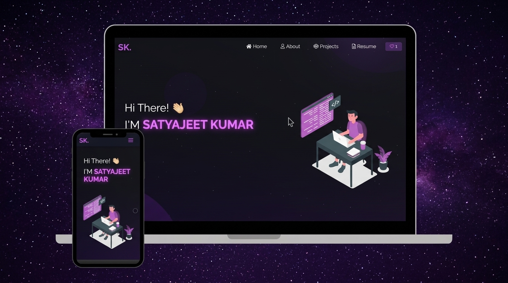

<h1 align="center">
  🚀 Satyajeet Kumar | Portfolio Website
</h1>

<p align="center">
  <b>B.Tech in Computer Science and Engineering (IoT &amp; Cybersecurity)</b><br/>
  <i>C V Raman Global University, Bhubaneswar</i>
</p>

<div align="center">
  
</div>

<br/>

<div align="center">

[](https://reactjs.org/)
[](https://getbootstrap.com/)
[](https://developer.mozilla.org/en-US/docs/Web/JavaScript)
[](LICENSE)

</div>

---

## 👨‍💻 About Me

Hello! I'm **Satyajeet Kumar**, a passionate Computer Science student specializing in **IoT &amp; Cybersecurity** at **C V Raman Global University, Bhubaneswar** (CPI: **9.21**).

- 🛡️ **Specialization:** IoT &amp; Cybersecurity
- 🏆 **Achievement:** Finalist at the **NIST Science Exhibition (2023)** for developing a working model for Railway Accident Prevention
- 💻 **Core Technical Skills:** C / C++, Linux CLI, Python, Networking, SQL, React.js, JavaScript
- 📬 **Email:** [satyajeet5219@gmail.com](mailto:satyajeet5219@gmail.com)
- 🔗 **LinkedIn:** [linkedin.com/in/satyajeet-kumar-29339638a](https://www.linkedin.com/in/satyajeet-kumar-29339638a)
- 📱 **Phone / WhatsApp:** [+91 8144976360](https://wa.me/918144976360)

---

## 🌟 Featured Projects

1. 🎓 **[UniVerse: Campus Utility App](./projects/campus-utility-app)**
   - Smart Timetable with Attendance Target &amp; Bunk/Attend threshold calculator.
   - Peer-to-Peer Notes Sharing &amp; Study Resource repository.
   - Secure Campus Lost &amp; Found network with anti-fraud claim verification.

2. 🚂 **Railway Accident Prevention System**
   - *Finalist at NIST Science Exhibition (2023)*.
   - Functional working model demonstrating automated collision mitigation and track safety.

3. 🌐 **IoT Smart Sensor &amp; Alert System**
   - Real-time telemetry monitoring, threshold detection, and automated alerting across connected endpoints.

4. 🔒 **Cybersecurity Network Inspector**
   - Packet header inspection and telemetry analysis for identifying local protocol anomalies and security risks.

5. ⚡ **C Language System Utilities**
   - Low-level system utilities built for Linux environments exploring memory management, file I/O, and process control.

---

## 🛠️ Built With

- **Frontend:** React.js, React-Bootstrap, CSS3, Typewriter-effect, React-tsparticles
- **Icons & Styling:** React-Icons, Tilt parallax, Responsive flexbox layouts
- **PDF Resume Viewer:** React-PDF &amp; PDF.js

---

## 🚀 Getting Started

### Prerequisites
- Node.js (v14+ recommended)
- npm or yarn

### Installation & Run

1. Clone or open the repository:
   ```bash
   cd Portfolio
   ```

2. Install dependencies:
   ```bash
   npm install
   ```

3. Start the development server:
   ```bash
   npm start
   ```

4. Open [http://localhost:3000](http://localhost:3000) in your browser.

---

## 📬 Connect With Me

- **LinkedIn:** [Satyajeet Kumar](https://www.linkedin.com/in/satyajeet-kumar-29339638a)
- **Email:** [satyajeet5219@gmail.com](mailto:satyajeet5219@gmail.com)
- **WhatsApp:** [+91 8144976360](https://wa.me/918144976360)
