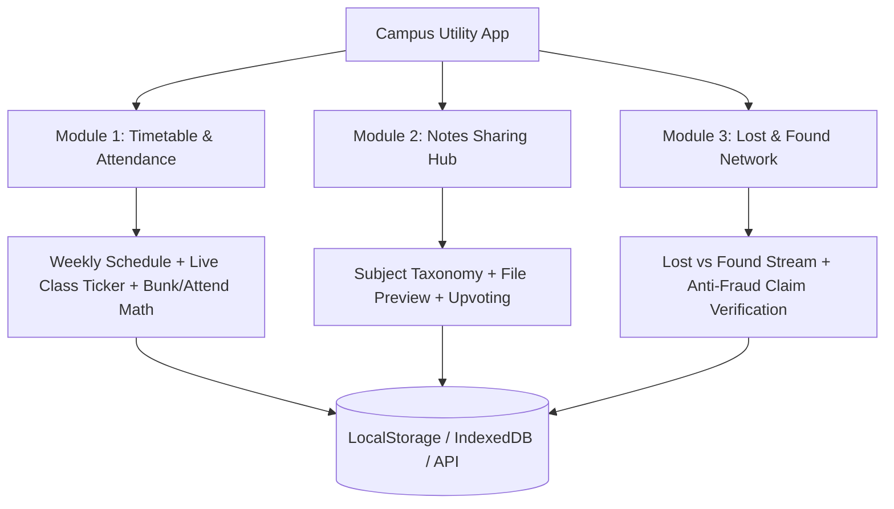

# 🎓 UniVerse: Campus Utility App

A portfolio-grade Campus Utility Platform designed to solve the three most critical daily friction points for university students:
1. 📅 **Smart Timetable & Attendance Tracker**
2. 📚 **Peer-to-Peer Notes & Study Hub**
3. 🔍 **Campus Lost & Found Network**

---

## 🏗️ System Architecture & Engineering Highlights

This project demonstrates clean code principles, modular component architecture, and responsive UX design.



---

## 📦 Module Breakdown & Features

### 1. 📅 Smart Timetable & Attendance Tracker
- **Dynamic Weekly Grid**: Interactive timetable with color-coded course blocks, faculty names, and hall/room numbers.
- **"Live Now & Up Next" Widget**: Real-time lecture status indicator with countdown timer and room directions.
- **Attendance Target Calculator**:
  - Target percentage threshold (e.g. 75% minimum required by university).
  - Bunk vs. Attend calculator: calculates exactly how many classes you can safely miss or must attend consecutively to stay above the threshold:
    $$\text{Target: } \frac{\text{Attended} + x}{\text{Total} + x} \ge 0.75$$
- **Schedule Sync**: Quick export to standard `.ics` (Google Calendar / Apple Calendar).

---

### 2. 📚 Peer-to-Peer Notes & Resource Sharing
- **Taxonomy & Filtering**: Structured categorization by Department (CSE, IT, ECE, ME, etc.), Semester (1-8), Subject Code, and Module/Unit.
- **Rich Document Uploads**: Support for PDFs, lecture summaries, formula cheat sheets, and past examination papers.
- **Community Trust System**: Upvoting, download counter, and "Verified by CR/Faculty" trust badge.
- **In-App Document Viewer**: Built-in modal viewer for previewing resources before downloading.

---

### 3. 🔍 Campus Lost & Found Community Hub
- **Dual Stream Categorization**: Real-time feeds for "Lost Items" and "Found Items" with status tags (`Reported`, `Claim Pending`, `Resolved`).
- **Rich Identification Cards**: High-res photos, exact location on campus (e.g. *Central Library 2nd Floor, Table 12*), timestamps, and item category.
- **Anti-Fraud Claim Verification Flow**: Claimers must answer verification questions or provide distinctive identification proof to prevent false claims.
- **Handover Security Protocol**: Pre-configured safe exchange points (Campus Security Desk, Student Council Office).

---

## 🛠️ Recommended Tech Stack

- **Frontend**: React 18 / TypeScript / Vite / Tailwind CSS / Lucide Icons
- **State Management**: React Context + Custom Hooks with LocalStorage / IndexedDB fallback (instant offline demo support)
- **Backend / API (Optional for full-stack)**: Node.js / Express or Next.js API Routes + SQLite / PostgreSQL / Supabase
- **Testing**: Vitest + React Testing Library

---

## 🚀 Folder Structure

```text
projects/campus-utility-app/
├── README.md                     # Project overview and documentation
├── src/
│   ├── components/
│   │   ├── common/               # Navbar, Sidebar, Modals, Badges
│   │   ├── timetable/            # ScheduleGrid, LiveTicker, AttendanceCalculator
│   │   ├── notes/                # NotesGrid, UploadModal, FilePreviewModal
│   │   └── lost-found/           # ItemCard, ReportItemModal, ClaimVerificationModal
│   ├── context/                  # AppStateContext, StorageContext
│   ├── hooks/                    # useAttendance, useFilter, useLocalStorage
│   ├── types/                    # TypeScript interfaces for Timetable, Notes, LostFound
│   ├── data/                     # Realistic campus demo mock data
│   ├── App.tsx                   # Main layout and tab router
│   └── index.css                 # Modern CSS design system
```
